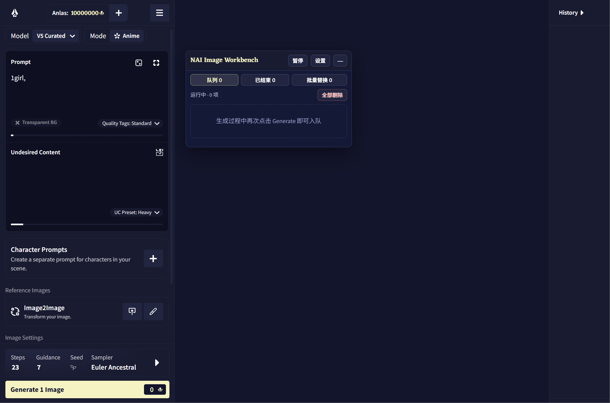

# NAI Image Workbench

NovelAI 生成一张图要等，等完才能点下一张。NAI Image Workbench 让你在生成过程中继续点击 Generate，把当时的配置排进队列，跑完再回来收图。



## 等待队列

NovelAI 空闲时，Generate 仍然是原来的 Generate，行为完全不变。正在生成或队列已有任务时，按钮会变蓝；此时点击会把当前配置排到队尾。

排队时会**冻结**当时的完整配置：Prompt、模型、参数，以及 Image2Image、Vibe Transfer 和 Precise Reference 中使用的图片。之后继续修改页面，不会污染已经记录的任务。

任务严格串行执行，不并发请求。遇到 429、服务端错误或网络中断时会自动重试；每次执行使用新的随机 Seed，其余配置保持不变。

暂停、继续、删除、清空和重新入队都包含在面板里。

<!-- 图片预留：docs/images/queue-panel.png -->

## 批量 Prompt 替换

在 Base Prompt 中放入一个占位符：

```text
1girl, {{artist}}, portrait
```

再给出一份按行分隔的替换列表：

```text
artist_a
artist_b
artist_c
```

脚本会依次生成：

```text
1girl, artist_a, portrait
1girl, artist_b, portrait
1girl, artist_c, portrait
```

一个批次只使用一种占位符，但同一个占位符可以出现多次。列表最多 500 行；每行成功后才会从剩余列表移除，所以暂停不会丢掉进度，尚未处理的部分也可以直接编辑。

<!-- 图片预留：docs/images/batch-panel.png -->

## 安装

需要 Chrome 或其他 Chromium 浏览器、[Tampermonkey](https://www.tampermonkey.net/)，以及一个能够正常生成图片的 NovelAI 账号。

1. 安装并启用 Tampermonkey。
2. 点击[安装 NAI Image Workbench](https://raw.githubusercontent.com/KaerMorh/nai-image-workbench/main/nai-image-workbench.user.js)。
3. 在 Tampermonkey 页面确认保存。
4. 打开 [NovelAI Image Generation](https://novelai.net/image)。

面板默认出现在页面右侧。更新时重新打开安装链接并确认覆盖即可。

Firefox 尚未经过适配测试，可能可以运行，但目前不作保证。

## 需要知道的几件事

**队列依靠标签页执行。** 至少保留一个 NovelAI 图片页面，队列才能继续。关闭全部相关页面或退出浏览器后，执行会停止，但已记录的数据仍然保留。

**刷新页面会暂停结果不明的任务。** 刷新发生时，脚本无法可靠判断远端请求是否已经完成，因此会停下来等待确认，而不是冒险重复生成。

**Chrome 可能冻结后台标签页。** 如果启用了内存节省，请把 `novelai.net` 加入“始终保持这些网站处于活动状态”的例外列表。

**NovelAI 改版可能暂时打断脚本。** 本项目需要识别网页元素；官方前端结构变化后，可能需要同步更新。

## 更多

- 完整功能、设置和数据说明：[使用说明](docs/USAGE.md)
- 开发与贡献：[开发文档](docs/DEVELOPMENT.md) · [贡献指南](CONTRIBUTING.md) · [更新记录](CHANGELOG.md)
- 问题反馈：[GitHub Issues](https://github.com/KaerMorh/nai-image-workbench/issues)

提交问题时，请附上浏览器和 Tampermonkey 版本、复现步骤与控制台错误，并移除 Cookie、令牌和不希望公开的 Prompt。

队列数据只保存在当前浏览器的 IndexedDB 中；生成请求仍然发往 NovelAI 官方接口，脚本不经过额外的第三方服务器。

## License

[MIT](LICENSE)
